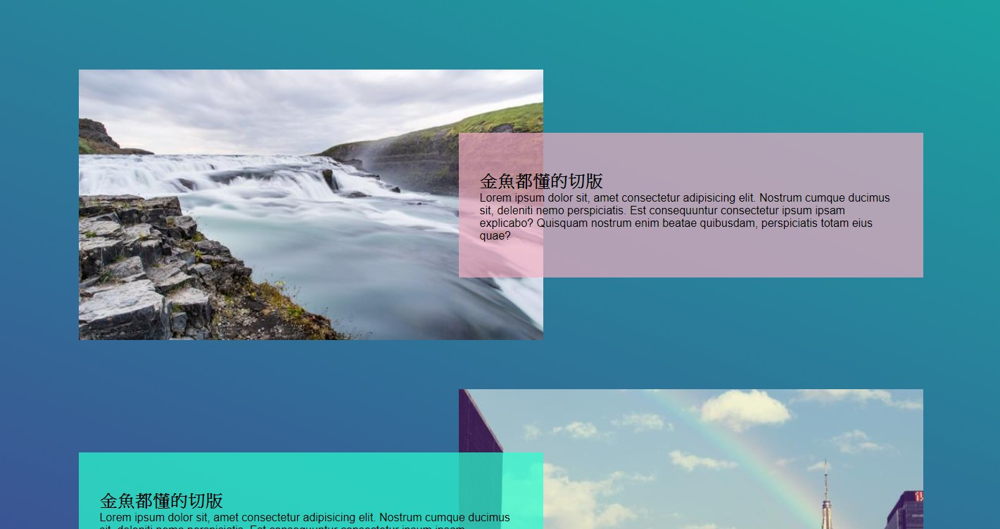

## 重點整理

- background:linear-gradient(角度,顏色 1,顏色 2)位置(center/fixed...) x 軸位置 y 軸位置 / 寬尺寸 高尺寸

- \.item > :first-child 只選到第一個子元素

從下面範例來看，只有 container 的第一個 p，This is the third child 會變大。

```html
<div class="container">
  <div>This is the first child</div>
  <div><p>This is the second child</p></div>
  <p>This is the third child</p>
</div>
```

```css
.container > p {
  font-size: 50px;
}
```

> 補充資料：https://pjchender.blogspot.com/2015/07/css.html

- 在這個案例中，使用了 flex-shrink:0，這時候因為寬超過，會導致畫面有問題，所以用 margin-right:-10%，將畫面調整回來。

- html 會依照順序渲染，所以在第二個 item 的時候，img 在 txt 前面，所以會被圖片壓到，這時候將位置改成相對定位，設定 z-index:1
