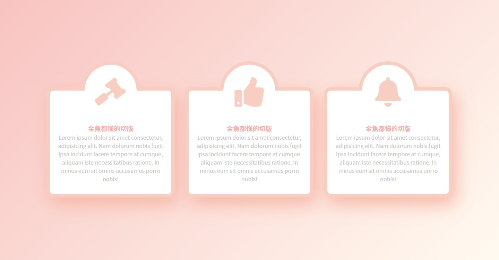

## 重點整理

- 動畫起手式 @keyframes、animation

設定一個動畫叫做 shake，然後一開始是-10deg，到最後會轉到 10deg，接著設置需要套用此動畫的 class。

> 補充資料：https://www.oxxostudio.tw/articles/201803/css-animation.html

```css
@keyframes shake {
  0% {
    transform: rotate(-10deg);
  }
  100% {
    transform: rotate(10deg);
  }
}

.item {
  animation: shake 0.5s linear infinite alternate;
}
```

linear 是指動畫加速的狀況，為 0-1，緩慢加速、可調整成 ease-in、ease-out、ease-in-out，0-1 會突然加速  
infinite 是指動畫會無限次數撥放，可調整成 次數(1~???)，或 inifinite  
alternate 是指動畫播放方向，可調整為 reverse、alternate、alternate-reverse

> 補充資料：https://www.oxxostudio.tw/articles/201803/css-animation.html

- line-height 設置跟外容器一樣，可以做到垂直置中的效果

原理是 line-height = 每行文字所佔的高度，從下面的設定來看，每行文字會佔高度 50px，但每個字只要 20px，於是把多出來的 30px(50-20)，平均分在上下 15px。

所以外容器如果剛好也是 50px，就可以達到垂直置中的效果。

```css
font-size: 20px;
line-height: 50px;
```

> 補充資料：https://blog.csdn.net/oscar92420aaa/article/details/51016205

- 用偽元素做出半圓的原理

1. 先建立出一個正方形
2. 設定上下左右 border 的顏色
3. 設定 border-radius:50% (呈圓形)
4. 設定將其中兩個顏色設定為透明
5. 選轉 45、-45 度之後就可以得到一個半圓
6. 用偽元素的話是從 border 開始計算，所以 position 要把 border 的大小扣回去
