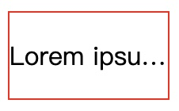
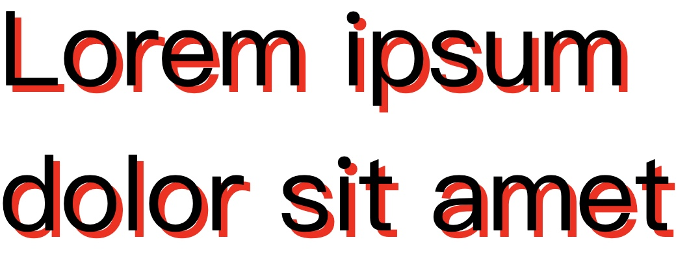
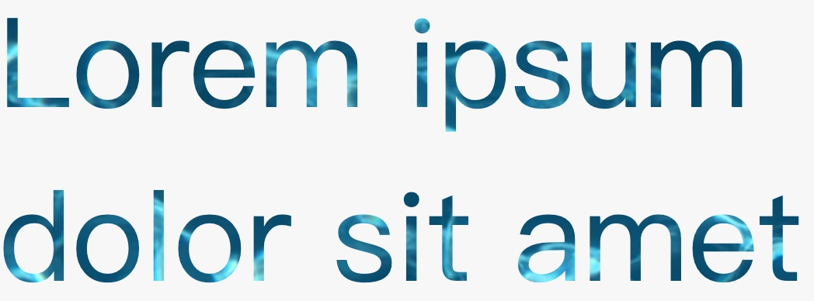
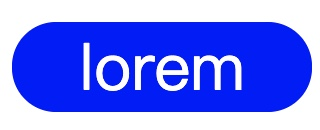

## text-overflow

使用text-overflow 可以做出 lorem"..."的效果



```html
<div class="container">
  <p>
    Lorem ipsum dolor sit amet
  </p>
</div>
```

```css
.container {
  width: 100px;
  border: 1px solid red;
}

p {
  text-overflow: ellipsis;
  white-space: nowrap;
  overflow: hidden;
}
```

## text-shadow



text-shadow就類似於box-shadow，只是是用於文字上面的。

```css
p {
    font-size: 5rem;
    text-shadow: 5px 5px 0 red;
}
```

## background-clip



可以把圖片的顏色套用在文字上

> 目前在chrome上面並不支援background-clip，必須要加上前綴字-webkit，但是firefox已經支援了，所以要先把-webkit寫上去

```css
p {
  font-size: 5rem;
  background-image: url("https://images.unsplash.com/photo-1568145675395-66a2eda0c6d7?ixid=MXwxMjA3fDB8MHxzZWFyY2h8M3x8d2F0ZXJ8ZW58MHx8MHw%3D&ixlib=rb-1.2.1&auto=format&fit=crop&w=800&q=60");
  -webkit-background-clip: text;
  background-clip: text; 
  color: transparent;
}
```

## all


使用all: initial 可以把所有之前的屬性都直接reset

```css
p {
    all: initial
}
```

## border-radius



正常來說如果要做出藥丸型的border-radius，需要把角度設為高度的一半，但不可能每次都知道高度是多少，在這種狀況設置成9999px，就永遠都會是藥丸的形狀。

```css
.container {
  width: 150px;
  background: blue;
  color: white;
  font-size: 2rem;
  text-align: center;
  border-radius: 9999px;
}
```