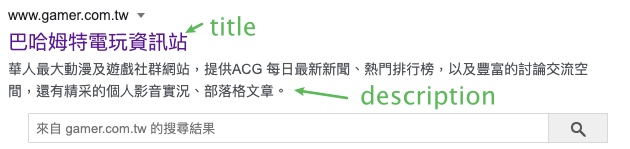
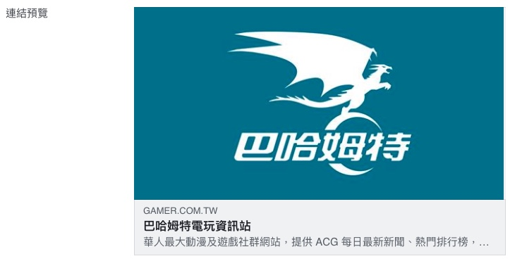

最近客戶的官網上線後，被主管說SEO都沒做好，於是今天就來研究了SEO的相關資料。

## SEO是什麼?

搜尋引擎最佳化(Search Engine Optimization)

簡單來說就是

    讓搜尋引擎(機器)看得懂你的網站

那麼，要如何做到這件事情呢？

> 話多不如話少，話少不如話巧。  
> 白話：少說屁話說重點

~~沒了，結束。~~  

## 如何讓機器看懂網頁 - head 篇

```html
<title>巴哈姆特電玩資訊站</title>
<meta name="description" content="華人最大動漫及遊戲社群網站，提供 ACG 每日最新新聞、熱門排行榜，以及豐富的討論交流空間，還有精采的個人影音實況、部落格文章。">
```



title 網頁最上面以及搜尋引擎查詢到的文字  
description 搜尋引擎查詢到的補充文字

- title 建議中文保持在30個字元，英文在60個字元
- description 建議中文保持在80個字元，英文在160個字元

上面兩個建議我目前查了幾個資料都有不一樣的說法，但總結下來就是，屁話不要多，說話說重點就對了。

然後可以在最後都加上 品牌名稱 | 品牌特色 
> 類似這樣：(超好吃大亨堡 | james速食店)

```html
<meta property="og:title" content="巴哈姆特電玩資訊站">
<meta name="og:description" content="華人最大動漫及遊戲社群網站，提供 ACG 每日最新新聞、熱門排行榜，以及豐富的討論交流空間，還有精采的個人影音實況、部落格文章。">
<meta property="og:image" content="https://i2.bahamut.com.tw/bahaLOGO_1200x630.jpg">
<meta property="og:url" content="https://www.gamer.com.tw">
```

og:社群相關

og最白話的說法就是，要給社群媒體看的(fb,line,twitter)

臉書的話可以到 [Facebook Debugger](https://developers.facebook.com/tools/debug/) 來看分享網頁的話，畫面會長什麼樣子。



> 補充 og:image 圖片尺寸  

- 大小不要超過 8 m  
- 尺寸要大於 200px * 200px，否則連圖都抓不到  
- 想要在高解析度裝置也不失真，建議寬度至少為 1200  
- 如果圖片為長方形  
    - 建議最小尺寸 600px * 315px（ 或同比例 1.91 : 1 ）
- 如果圖片為正方形
    - 建議最小尺寸 600px * 600px （ 或同比例 1 : 1 ）

>資料來源：[Yakim shu-基礎SEO標籤](https://yakimhsu.com/project/project_w6_HTML_SEO.html)

## 如何讓機器看懂網頁 - body 篇

```html
<h1>MYPROTEIN</h1>

```

    h1 通常是拿來寫主要標題

一整個頁面只能有一個h1，通常會是這整個品牌的名稱。

接下來內容文章的大標要用h2

    img 後面的alt要放關鍵字

這樣搜尋引擎在查詢的時候可以直接用圖片搜尋到這個網站

以上面的範例來看，我只要打MYPROTEIN，就可以直接透過搜尋引擎查到這個圖片，進而增加轉換率。

如果是裝飾性圖片可以不使用alt，而是應該用在有意義的圖片。

## 實際應用

以下來源都是 [HARRIS先生-認識SEO的Title Tag](https://www.yesharris.com/seo-title-tag/) 因為這篇寫得太好了，所以我引用來源就直接記錄了。

不同頁面類型的 Title範例參考
其實不同類型跟不同產業的網頁 Title，在設計上有一些常見的範例會是通則可以參考，比方說： 

### 首頁
    首頁通常在 Title設計上，只要帶到品牌名以及品牌的核心理念/訴求即可，以【品牌名】+ 【品牌核心理念】為主軸

Harris先生 – Google Analytics 網站分析、白帽SEO傳教士

瘋狂賣客Crazymike線上購物–免運送到家| 購物賺瘋幣、消費全額抵！  

蝦皮購物| 花得更少買得更好

### 商品頁
    為了讓搜尋者在搜尋結果上可以得知完整的商品資訊，商品頁面的 Title通常會放上完整的商品資訊，來幫助搜尋者判斷你的頁面是不是他要的商品，同時，也不要忘記放上品牌名在尾段來得到品牌的曝光，以【商品名稱/規格描述】+ 【品牌名】為主軸

ASUS ZenFone 5 ZE620KL (4G/64G) – PChome 24h購物

Asus Padfone –Yahoo 奇摩購物中心

強韌護色洗髮精-髮絲強健不斷裂，有效護色、煥發亮澤 – 綠藤生機

當然，如同我們剛剛提到的，如果你的 Title不會太長，你也可以在Title尾段的【品牌名】放上一些品牌的主要訴求/核心價值，像是：

(限時)【KLORANE奎寧】養髮洗髮精400ml | 瘋狂賣客天天特賣會 (＂天天特賣會＂為主要形象/訴求)

ENIE 雅如詩~宇宙染補色洗髮精(300ml) 野豔紅／亞麻綠 – 小三美日 | 平價美妝 (＂平價美妝＂為主要訴求)

### 文章頁面
    文章頁面的 Title設計是最為單純的，通常直接以【文章名稱】+ 【品牌名】為主軸，例：

用Google Analytics 的《內容分組》，輕鬆做好網站分類| Harris先生

10/5星座點點名：魔羯座跟老闆聊天好事會發生！每日星座進化2.0 – 妞新聞

歐洲真的需要財政和政治聯盟嗎？ – The News Lens 關鍵評論網

### 服務型網頁（通常為B2B產業）
    有些企業的網站主要是為了推廣自己家的服務性產品，比方說像是顧問、會計、B2B的採購/代工，這種狀況下 Title並沒有一個通則，你必須要根據你的服務特性、特質，在 Title裡面帶到你想操作的關鍵字，並且加以描述你的服務特色，來幫助搜尋者了解你的服務，畢竟有部分搜尋者可能就是你的潛在客戶，幫助潛在客戶了解你，肯定對商業是有正向幫助的

SEO顧問服務，業界最有誠信，15年 SEO顧問經驗 – xxx顧問公司

（希望操作的關鍵字為＂SEO＂）

團體衣服訂製，高品質布料、安全 SGS認證 – xxx 團體服飾

（希望操作的關鍵字為＂團體衣服＂）

醫療器材訂製 – 衛生署認證，幫助你照顧你的病患 – xxx 醫療器材

（希望操作的關鍵字為＂醫療器材訂製＂）

---

最後要感謝[HARRIS](https://www.yesharris.com/)、[Yakim shu](https://yakimhsu.com/)做了相關的資料整理。
