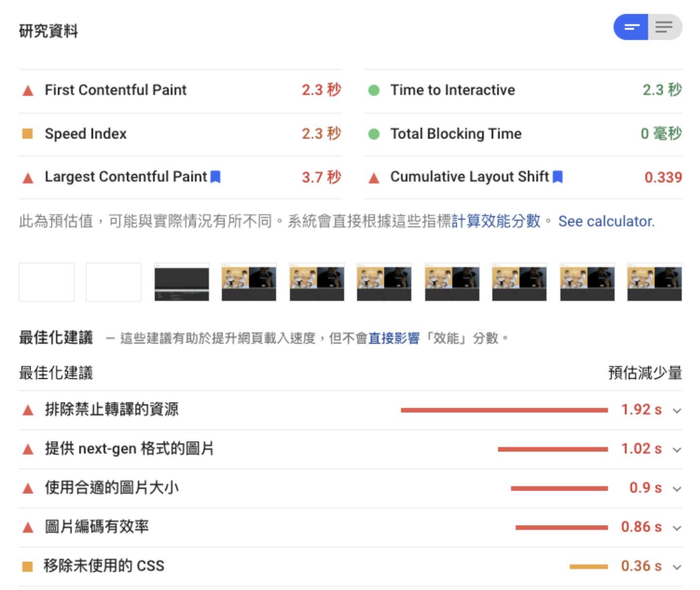
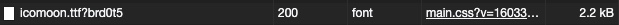
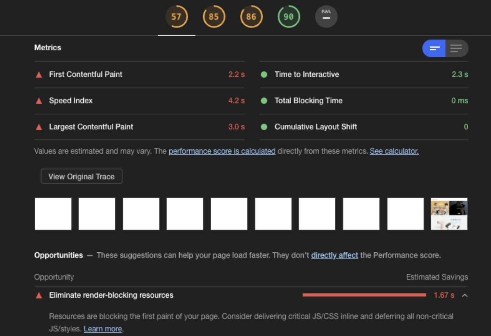
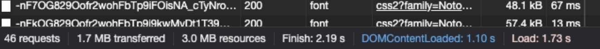
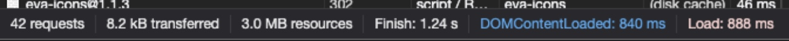
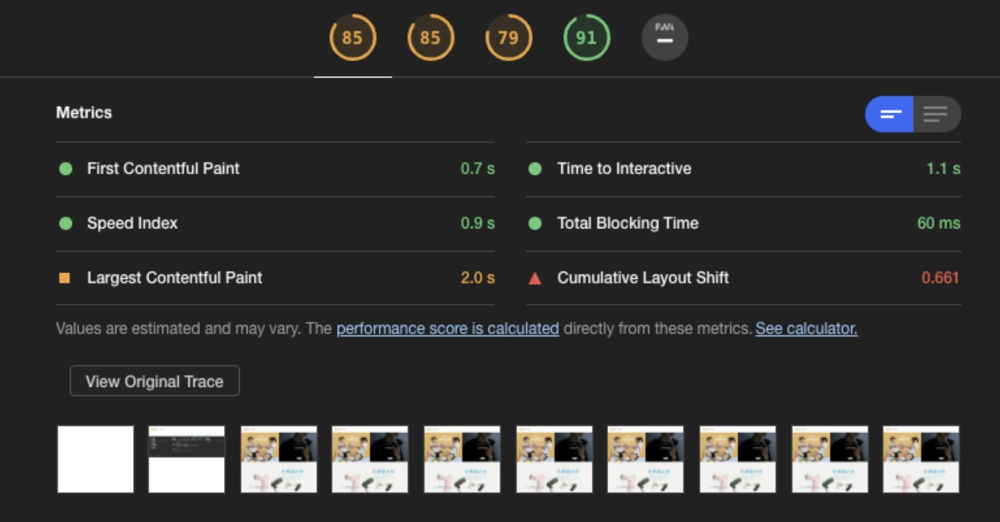
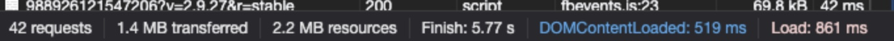
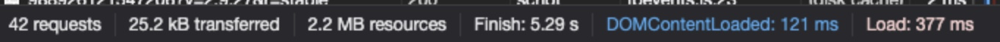
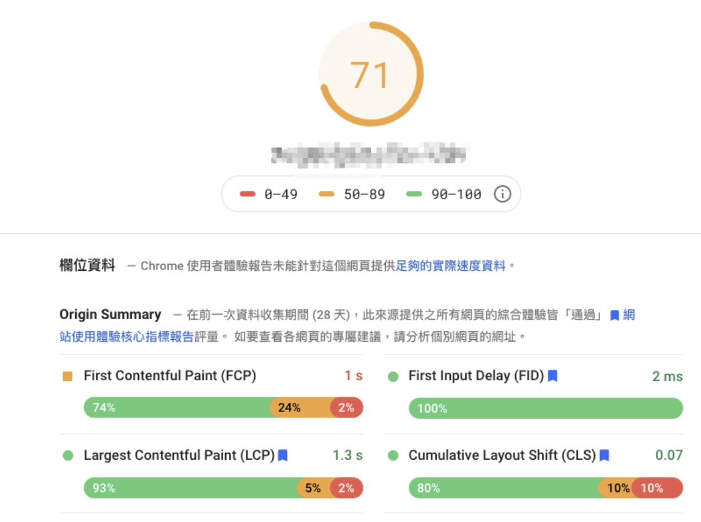

最近因為公司那邊沒有什麼需求，覺得要找點事情做，決定來對產品做優化，但因為以前也沒有做過效能的優化，這是第一次做優化，所以大部分的知識都是從網路上文章找來的，那事不宜遲，就來介紹一下我做了哪些事。

## 什麼是性能優化

根據 Amazon 內部統計，網頁載入的速度每增加100ms，營收就減少 1%。網站速度越慢，客戶越不願意掏出錢來買你的東西。另外網頁載入速度也會影響 SEO。

所以當你的網頁載入很慢的時候，就要考慮對你的網頁資源做優化了。

市面上有非常多的網頁評分工具，使用網頁評分可以了解你的網頁在初次渲染的時候怎麼樣，我這邊使用的是PageSpeed insights 跟 lighthouse，因為PageSpeed只能抓取公開的網站，我在第一次做的狀況下不敢隨便亂推到正式機，後來查詢到lighthouse是可以拿來觀測本機網頁的評分工具，所以接下來的文章會以這兩個為主。

## 發現問題點

第一步，先了解自己的缺點，如果連自己哪裡有問題都不知道，那也是沒有用，就像你要去101但你往高雄走，努力完全用錯地方。

這次使用的網頁評分工具

- PageSpeed Insights
- Lighthouse

首先先將自己的網頁丟到PageSpeed Insights上面，可以看到相關的評分



分析完之後可以網頁的綜合評分為57分，可以看到其中的四個指標，最關鍵的點就是FCP及LCP。

- FCP
    - 第一次渲染出畫面的時間，這時候還沒有套入任何的樣式。(意思就是說從發出request到渲染就花了2.3秒)
- LCP
    - 顯示最大內容元素所需時間 (簡單來說就是頁面完全載入，user已經可以看見內容的時間)

然後下面可以看到最佳化建議有這幾項

- 排除禁止轉譯的資源
    - 簡單來說就是減少外部資源載入的時間
- 提供next-gen 格式的圖片
    - 提供JPEG2000、JPEG XR、WebP三種格式的圖片
- 使用合適的圖片大小
    - 如果這邊的圖片大小只要400*400，提供了一個1000*1000的圖片，瀏覽器就要再自己幫你調整，一張可能還好，但是多張的話也是會造成時間的緩慢。
- 圖片編碼有效率
    - 考慮圖片是否真的需要，可否替代or優化
- 移除未使用的CSS 
    - 如同字面意思，把你網頁沒用到的CSS清除掉

從上面的評分就可以得知，前面三點就是我必須優化的方向，所以就已上面的三個關鍵字去Google。

## 如何解決

### 排除禁止轉譯資源

解決的方向，先從自己可以動手的開始，從第一點來看，都是因為外部資料載入太久，導致CSS無法渲染。

#### CSS檔案

從建議可以發現，主要是這三個影響到的
- font-awesome
- Noto Font
- 第三方plugin

因為第三方plugin是我們後端在用的，我這邊先不做處理。

所以關鍵字就是font-awesome、Font Optimize。

        font-awesome

因為用CDN載入font-awesome都會一整包一起載下來，但可能只用到其中幾個icons而已，所以這邊有篇文章建議用線上的工具將想要使用的幾個選出來。(參考資料 1)

從下面的圖可以看到，原本載入所有icon的css有11.1KB，經過處理之後變成的2.2KB




        Google font

爬文之後發現其實載入的話應該盡可能用link去預先載入，才不會影響到CSS可以渲染的時間。

原本的使用是

```scss
@import url("https://noto+font ....")
```

調整成
```html
<link rel="preload" href="https://noto+font ...." as="style">
<link rel="stylesheet" href="https://noto+font ....">
```

> 參考資料：  
[1. optimize-fontawesome](https://blog.webjeda.com/optimize-fontawesome/#the-hard-way)  
[2. stackoverflow - Icluding google web fonts link or import](https://stackoverflow.com/questions/12316501/including-google-web-fonts-link-or-import)  
[3. 網頁加載字型&FOUT與效能測試](https://medium.com/lucys-design-life/%E7%B6%B2%E9%A0%81%E5%8A%A0%E8%BC%89%E5%AD%97%E5%9E%8Bfoit-fout%E8%88%87%E6%95%88%E8%83%BD%E6%B8%AC%E8%A9%A6-cb0b03daad60)

#### JS檔案

盡量使用defer、async載入外部檔案。  
簡單來說就是，最簡單的處理方式就是把script的相關js都放在\</body>之前

#### Minify、bundle CSS 和 Javascript

市面上有很多可以Minify跟bundle的工具，像是Gulp、Webpack都可以做到這件事情，但因為我們公司內部的JS很混亂，前後端混雜在一起，我目前只能把第三方的JS拆成一包vender.bundle.js，其他的部分還是只能混在一起QQQQQQQQ。

#### 其他

還有一些相關的優化，但我覺得對效能影響沒有上面的幾點大

- 圖片的RWD可以使用 picture source 去做調整
```html
<picture>
    <source media="(max-width: 768px)" srcset="md.jpg"/>
    
</picture>
```
- 將所有圖片都設上寬跟高
- 因為首頁的圖片只有兩張，所以我有先用Gulp做壓縮，網路上也有很多壓縮圖的網站可以使用。

## 優化結果

優化前(lighthouse)

- performace 57
- FCP 2.2s
- LCP 3.0s
- load (without cache) 1.73s
- load (with cache) 888ms







---

優化後(lighthouse)

- performace 85
- FCP 0.7s
- LCP 2.0s
- load (without cache) 861ms
- load (with cache) 377ms







可以看到整體分數往上升，FCP、LCP也大幅下降，看來這次的優化經歷算是成功的，不過我有查詢到相關資料說明，網頁優化還要跟內容做取捨，很多知名網站跑分其實也不高，但是SEO仍然排名很前面，所以說並不需要太強調優化及拉高分數，內容跟性能之間取得個平衡就好。

最後 推到正式機之後用PageSpeed insights測試也有顯著的上升效果



> 參考資料：
[5 tricks to eliminate render blocking resources](https://blog.logrocket.com/5-tricks-to-eliminate-render-blocking-resources/)